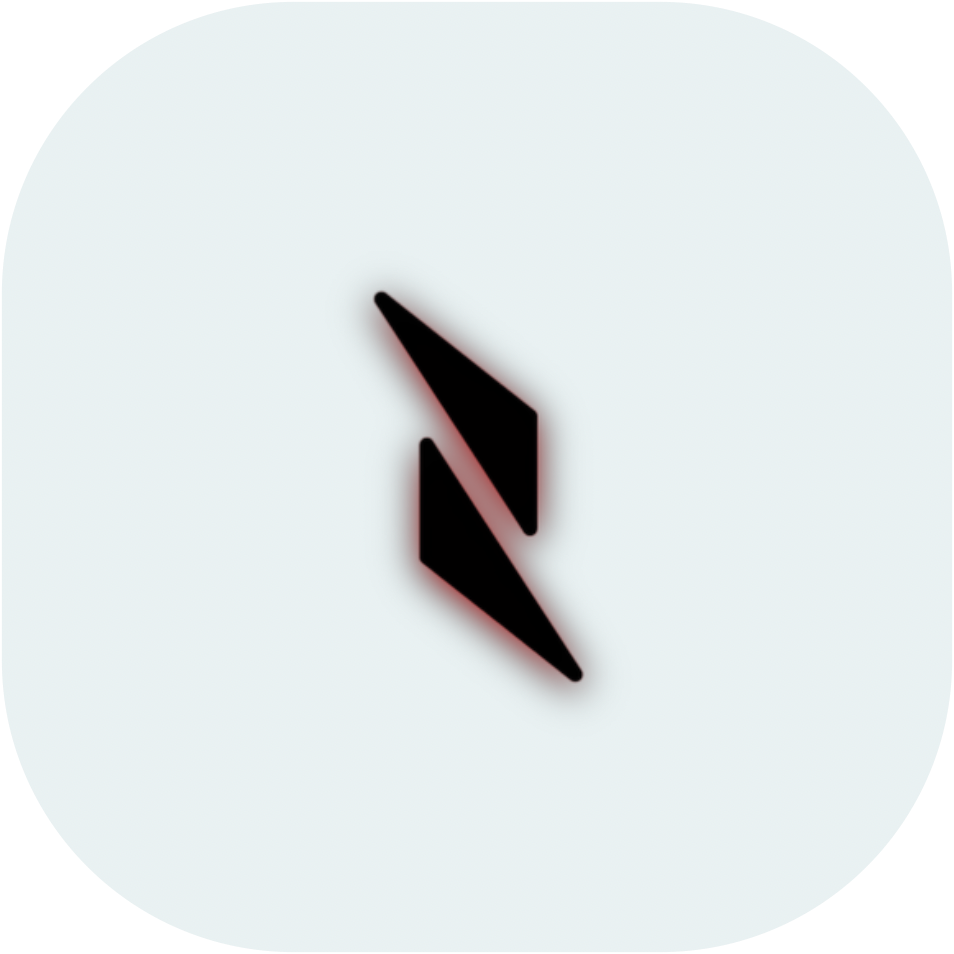
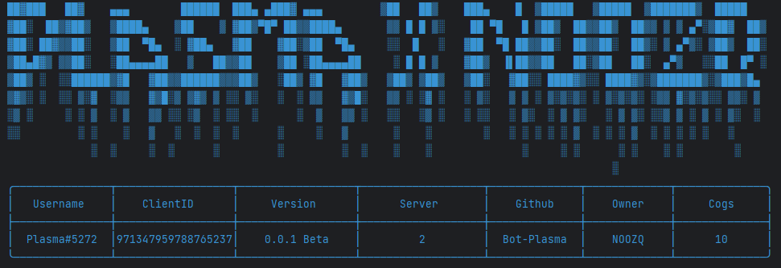

<h3 align = Center>LYRA LEAGACY</h3>
<h1 align = Center></h1>
<h1 align = Center></h1>
<h3 align = Center>
  
  [Invite](https://discord.com/api/oauth2/authorize?client_id=971347959788765237&permissions=8&scope=bot)
</h3>

  <a href="#Commands">Generell</a>
  •
  <a href="#plugins">Plugins</a>
  •
  <a href="#support">Support</a>
  • 
  <a href="#Changelogs">Changelog</a>
<h1></h1>
  
<h2 align="">Generell</h2>

- Prefix : `!` 
- Moderation
- Giveaway features
- AutoMod features
- Welcome messages
- Reaction Role
- Modmail
- Invite Tracker
- Auditlogs
  </h2>
  
<h2>Plugins</h2>

> [Github]()

<h2 align="">Support</h2>

> [Discord](https://discord.gg/WjYrRvZM9Q) 

> [Website](https://soon.de/)

<h2 align="">Changelog</h2>

 - [+] Changename
 - [+] embedchange
